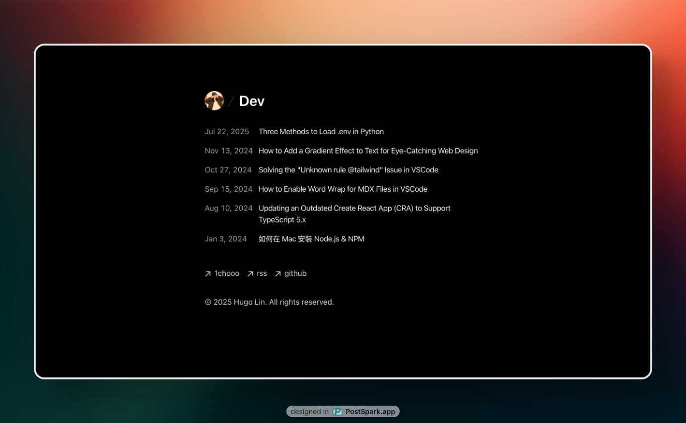

<div align="center">
  
<h1>Blog</h1>

Dev Blog by Hugo Lin

<div align="center">
  <a href="https://youtu.be/omwBe_uhwFc?si=f0kWVlJnw2xvSOTu">
    
  </a>
</div>

[🌐 Example Site](https://dev.1chooo.com)

</div>

## Features

- Markdown-powered posts
- Light / Dark theme
- Responsive design
- Syntax highlighting
- SEO Friendly
- View counter
- Google / Vercel Analytics

## Get Started

1. Fork the repository
2. Create Supabase project
3. Set up environment variables in `.env.local`:
    ```bash
    POSTGRES_URL="YOUR_POSTGRES_URL"
    POSTGRES_USER="YOUR_POSTGRES_USER"
    POSTGRES_HOST="YOUR_POSTGRES_HOST"
    SUPABASE_JWT_SECRET="YOUR_SUPABASE_JWT_SECRET"
    NEXT_PUBLIC_SUPABASE_ANON_KEY="YOUR_NEXT_PUBLIC_SUPABASE_ANON_KEY"
    POSTGRES_PRISMA_URL="YOUR_POSTGRES_PRISMA_URL"
    POSTGRES_PASSWORD="YOUR_POSTGRES_PASSWORD"
    POSTGRES_DATABASE="YOUR_POSTGRES_DATABASE"
    SUPABASE_URL="YOUR_SUPABASE_URL"
    NEXT_PUBLIC_SUPABASE_ANON_KEY="YOUR_NEXT_PUBLIC_SUPABASE_ANON_KEY"
    NEXT_PUBLIC_SUPABASE_URL="https://kmvqinruhkfqurwnmlxf.supabase.co"
    SUPABASE_SERVICE_ROLE_KEY="YOUR_SUPABASE_SERVICE_ROLE_KEY"
    POSTGRES_URL_NON_POOLING="YOUR_POSTGRES_URL_NON_POOLING"

    GOOGLE_ANALYTICS_ID="YOUR_GOOGLE_ANALYTICS_ID"
    ```
4. Run the development server
    ```bash
    pnpm install
    pnpm dev
    ```
5. Open your browser at `http://localhost:3000`
6. Edit your post in the [`src/content/`](src/content/) folder (see [template](src/content/template/) for writing posts)

If you'd like to deploy your blog...

- with Vercel: add environment variables in settings and [follow the docs](https://vercel.com/docs/deployments)
- by yourself: copy above content to .env.local
Deploy the site and login to start blogging!

## License

Under the [MIT License](./LICENSE).
